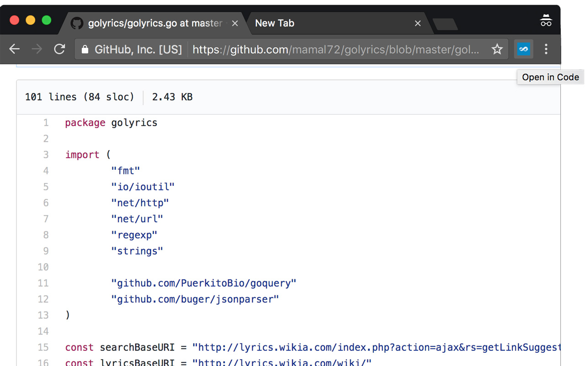

# Open in Code

A simple Chrome Extension in _<70 lines of code_ that adds a button (a [page action](https://developer.chrome.com/extensions/pageAction)) for downloading and opening current viewing Github file in [Microsoft Visual Studio Code](https://code.visualstudio.com/).

## Screenshot

## Installation

You can install this extension from [Chrome Web Store](https://chrome.google.com/webstore/detail/open-in-code/pojigilicipchiacceabcigkhkjhdcie).

## Ideas or Issues

Create an issue and describe it. I'll check it ASAP!

## Contribution

You can fork the repository, improve or fix some part of it and then send the pull requests back if you want to see them here. I really appreciate that. ❤️

## License

Licensed under the [MIT License](https://github.com/mamal72/open-in-code/blob/master/LICENSE).